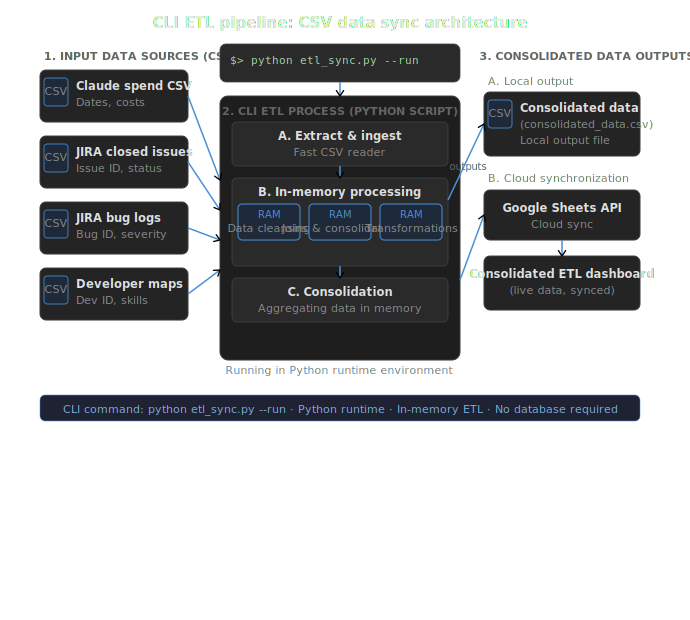
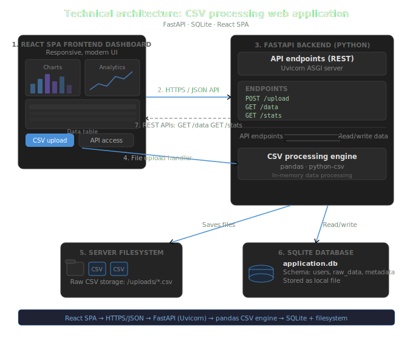

# TokenToTask

**Turn Claude Code usage into delivery intelligence — per developer, per sprint.**

> ⚠️ **Honest disclaimer upfront:** This is a Proof of Concept. It works. It produces real, useful metrics. But it is held together by manual CSV exports from two external systems — Claude Console and Jira — that we do not control. If either of them changes their export format, this breaks. We know. That's what v3 is for.

---

## 📋 PRD Documentation

We went through three rounds of product thinking to get here. Each document solved a real problem the previous one created. Click to read the exact spec:

| # | Document | Purpose |
|---|---|---|
| 1 | [**The Problem PRD**](./The%20problem_%20Developer-Productivity-Dashboard-PRD.pdf) | Defines the business problem: AI adoption with no measurement layer. Scopes what data we have, what we need, and why joining Claude Console + Jira is the right move. |
| 2 | [**Web App PRD**](./WebApp_%20Developer-Dashboard-PRD.pdf) | Translates the problem into a product spec. Covers the v1 CLI, its limitations, and the case for a web interface with CSV upload, weekly/monthly views, and per-developer profiles. |
| 3 | [**Unified MVP PRD (Final)**](./WebApp_%20Developer-Dashboard-PRD.pdf) | The definitive spec. Resolves conflicts between the first two documents (web upload vs. server directory, weekly vs. monthly), introduces the weekly spend scaling fallback, and adds the settings/configuration layer. |

### Why did we need three PRDs?

Because the product changed as we understood the data better. The first document was written before we knew the Claude Console only exports monthly totals. The second document assumed a simpler ingestion path. By the time we understood the full constraints — weekly approximation, identity mapping, dual ingestion modes — neither document was accurate. The third one is the honest one.

---

## 🔍 The Problem

Cashflo's engineering team shifted to Claude Code as the daily driver for writing code. That shift was a deliberate bet. But after making it, we had no way to answer the questions that mattered:

- Is the team actually using Claude Code, or still coding manually?
- Is AI usage translating into more deliverables and faster delivery?
- What is the cost per deliverable, per developer, per sprint?
- Which developers are getting strong ROI, and which need coaching?

The data existed. Claude Console tracked every token spent and every line of code written. Jira tracked every deliverable, story point, and bug. But they lived in separate systems, were never joined, and produced no shared insight.

The result: management had a gut feeling about AI ROI, not a number.

---

## 💡 The Solution

A two-stage metrics engine that joins Claude Console and Jira data, per developer, per period — surfacing the output in a dashboard that both managers and developers can use without touching a terminal.

**Stage 1 → CLI** (v1): A Python ETL pipeline that merges the two CSV sources and outputs a flat metrics file.

**Stage 2 → Web App** (v2): A FastAPI + React interface that wraps the pipeline, stores historical data in SQLite, and makes the metrics browsable, filterable, and trend-able.

---

## v1: Command-Line Interface

The CLI is the core engine. It takes four CSV files, runs the metrics computation in-memory, and writes a single `output.csv` with one row per developer.

### Architecture



### What it does

1. Loads the Claude Console export → parses spend (USD) and lines of code per developer email
2. Loads the Jira deliverables export → closed Stories and Tasks with story points, sprint, epic, resolved date
3. Loads the Jira bugs export → bug tickets with created date, sprint, epic
4. Loads the developer map → bridges display names to emails
5. Computes per-developer metrics: efficiency score, cost-per-deliverable, bug attribution, traffic-light flag
6. Writes `output.csv` and optionally pushes to Google Sheets

### Output metrics per developer

| Metric | Description |
|---|---|
| `spend_usd` | Total Claude Code spend this period |
| `lines_of_code` | Lines written via Claude Code |
| `deliverables_count` | Jira Stories + Tasks closed |
| `story_points_delivered` | Sum of story points on closed issues |
| `story_points_coverage` | % of deliverables that had story points set |
| `cost_per_deliverable` | spend / deliverables |
| `lines_per_deliverable` | lines / deliverables |
| `cost_per_line` | spend / lines |
| `ai_efficiency_score` | story points / spend (suppressed if coverage < 80%) |
| `bugs_attributed` | Bugs linked to this developer's work (same epic + sprint, within 30 days) |
| `bug_rate` | bugs / deliverables |
| `flag` | green / yellow / red / gray — computed from relative efficiency + bug rate |

### Running the CLI

```bash
# Set up environment
python3 -m venv .venv
source .venv/bin/activate
pip install -r requirements.txt

# Run the pipeline
python merge.py \
  tests/fixtures/claude_export.csv \
  tests/fixtures/jira_deliverables.csv \
  tests/fixtures/jira_bugs.csv \
  tests/fixtures/developers.csv \
  --period 2026-05 \
  --output output.csv
```

### Known limitations of v1

- **No history.** Every run overwrites `output.csv`. There is no record of previous periods.
- **No UI.** You need terminal access to get results. Non-technical stakeholders cannot self-serve.
- **Manual every time.** Someone has to download CSVs, run the script, and share the output manually.

---

## v2: React + FastAPI Web Application (Current MVP)

The web app wraps the CLI pipeline in a proper product. It adds persistent storage, a browser-based upload interface, and interactive dashboards for both managers and individual developers.

### Architecture



### Stack

- **Frontend**: React SPA (Vite)
- **Backend**: FastAPI (Python) + Uvicorn ASGI
- **Database**: SQLite (`application.db`) — stores historical metrics per period
- **Pipeline**: The same `merge.py` engine from v1, invoked as a subprocess
- **Storage**: `/uploads/` directory for raw CSV files

### What it adds over v1

**For managers:**
- Team leaderboard — all developers ranked by flag, sortable by any metric
- Weekly and monthly period toggle
- Flag filter — show only red/yellow developers
- Team summary cards — total spend, total deliverables, average efficiency, flag distribution
- Team trends page — aggregate charts across all stored periods, AI adoption rate

**For developers:**
- Personal profile page — all metrics in one place with a plain-language explanation of their flag
- Week-over-week trend chart
- Month-over-month trend chart
- Bug attribution log — which bugs were attributed and why

**For admins:**
- CSV upload screen — drag-and-drop or directory scan (`./data_drop/`)
- Upload history log — timestamp, status, error details
- Settings editor — Jira base URL, developer identity mapping

### Quickstart

```bash
# 1. Build the React frontend
cd frontend
npm install
npm run build
cd ..

# 2. Set up the Python environment
python3 -m venv .venv
source .venv/bin/activate
pip install -r requirements.txt

# 3. Start the server
.venv/bin/uvicorn main:app --reload

# 4. Open http://127.0.0.1:8000
# Drop the files from tests/fixtures/ to see the dashboard populated
```

### 🔴 Live Demo
**[https://dashboard-poc.cashflo.io](https://dashboard-poc.cashflo.io)** *(Deploying soon — link will be live)*

---

## ⚠️ Blunt Assessment: What This Is and What It Isn't

This is a POC. It proves the concept. The metrics are real, the logic is tested, and the dashboard works. But before you treat this as production infrastructure, read this section carefully.

### The fragility problem

This entire dashboard depends on two external CSV export formats that we do not control:

**Claude Console export** — If Anthropic changes the column structure of their members CSV, `claude_loader.py` breaks immediately. Every loader function is hardcoded to specific column names.

**Jira export** — If the Jira admin changes the export filter template, renames a column, or adds a custom field that shifts the schema, `jira_loader.py` breaks. We have no schema validation layer that fails gracefully.

Both of these have happened in similar tools at other companies. It will happen here too.

### The weekly data problem

Claude Console only exports totals at a **calendar-month level**. It does not support weekly granularity natively.

To support the weekly view, the app approximates weekly Claude spend and lines of code by **dividing the monthly totals by 4.3**. This is a proxy, not real data. A developer who did all their work in week 1 and took week 4 off will show the same weekly numbers across all four weeks. We are transparent about this in the UI, but it is a real limitation.

### The identity problem

Developer identity is bridged via a `developers.csv` mapping file (display name → email). If a developer's Jira display name is inconsistent — nickname in one sprint, full name in another — they get split into two developer records and their metrics are distorted. This requires manual maintenance.

In v2 the mapping is editable via the Settings UI, which helps. But it is still a manual process.

### What this proves

- The data join between Claude Console and Jira produces meaningful metrics
- Token spend + deliverables + bug attribution together tell a real story about AI-assisted development ROI
- Managers and developers both want this visibility — the question was never *if*, it was *how well*

### What v3 needs to solve

- Direct Jira REST API integration (OAuth) — no more CSV exports
- Anthropic Usage API integration — real daily token data, not monthly approximations
- Schema validation with graceful error handling — not silent corruption
- Proper auth layer — right now everyone sees everything

---

## 📁 Project Structure

```
TokenToTask/
├── merge.py                  # Core ETL pipeline (v1 CLI entrypoint)
├── main.py                   # FastAPI app entrypoint (v2)
├── requirements.txt
├── .env.example
├── src/
│   ├── loaders/
│   │   ├── claude_loader.py  # Parses Claude Console CSV
│   │   └── jira_loader.py    # Parses Jira deliverables + bugs CSVs
│   ├── metrics.py            # Efficiency score, cost, coverage calculations
│   ├── guardrail.py          # Bug attribution + traffic-light flag logic
│   ├── models.py             # Dataclasses: Deliverable, Bug, DeveloperMetrics
│   ├── output.py             # CSV writer
│   └── sheets.py             # Optional Google Sheets sync
├── frontend/                 # React SPA (Vite)
├── tests/
│   ├── fixtures/             # Sample CSVs for local testing
│   ├── test_metrics.py
│   ├── test_guardrail.py
│   ├── test_claude_loader.py
│   └── test_output.py
├── uploads/                  # Raw CSV storage (gitignored)
├── data_drop/                # Server directory scan path (gitignored)
└── docs/
    ├── cli_architecture.png
    └── webapp_architecture.png
```

---

## 🧪 Running Tests

```bash
pytest tests/ -v
```

All core logic — metrics computation, bug attribution, flag calculation, CSV parsing — is unit tested against the fixture files in `tests/fixtures/`.

---

## 🗺️ Roadmap

| Version | Status | What it adds |
|---|---|---|
| v1 — CLI | ✅ Done | Core ETL pipeline, metrics engine, Google Sheets sync |
| v2 — Web App | ✅ Done (POC) | FastAPI + React UI, SQLite history, CSV upload, trend charts |
| v3 — API integrations | 🔜 Planned | Jira OAuth REST API, Anthropic Usage API, real weekly data, auth layer |

---

## 🤝 Contributing

This is an internal POC open-sourced for the community. If you are running Claude Code across an engineering team and want the same visibility, the fixture files in `tests/fixtures/` show exactly what CSV format the loaders expect.

PRs welcome, especially for:
- Schema validation improvements
- Alternative data source adapters (Linear, GitHub Issues)
- Better weekly approximation logic

---

*Built by the Cashflo engineering team · MIT License*